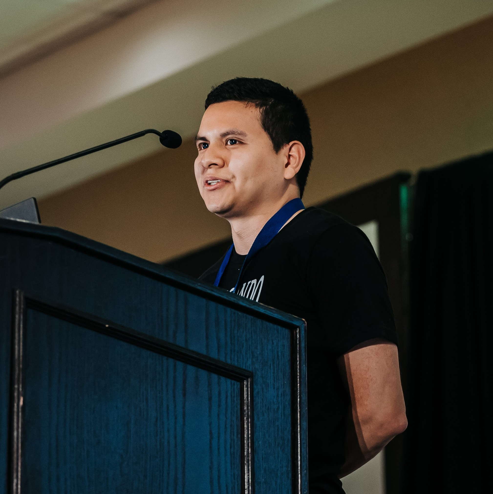

# Santos Gallegos

{ width=150px }

## Experiencia laboral

- **Read the Docs, Inc**: Software developer (2018 - presente)
- **Cooperativa CB**: Auditoría de seguridad informática (2022)
- **Impodirect, CIA LTDA**: Auditoría de seguridad informática (2021 - 2022)
- **Cooperativa CB**: Auditoría de seguridad informática (2020)

## Concursos

- **Devsu Code Jam**: Séptimo lugar categoría de profesionales (2019)
- **IEEEXtreme Programming 11.0**: Primer lugar a nivel nacional con el equipo trivialbox (2017)
- **IEEEXtreme Programming 10.0**: Primer lugar a nivel nacional con el equipo trivialbox (2016)
- **Rally Latinoamericano de Innovación**:
  Primer lugar a nivel local (Cuenca) y nacional en la categoría de innovación con el equipo Atuk Maskhay (2016)
- **Hackaton UPS**: Segundo lugar con el equipo trivialbox (2016)
- **IEEEXtreme Programming 9.0**: Tercer lugar a nivel nacional con el equipo EnigmaT (2015)

## Habilidades y conocimientos

- Python
- Django
- C
- Git
- Free and Open Source Software
- Elastic Search
- Testing
- Computer security
- Algorithms
- Problem solving
- Web development
- Linux
- Open Source maintainer
- Rust

## Idiomas

- Español (nativo)
- Inglés (fluente)

## Redes

- **GitHub**: <https://github.com/stsewd>
- **Hackerrank**: <https://www.hackerrank.com/stsewd>
- **HackerEarth**: <https://www.hackerearth.com/@stsewd>
- **Stack Overflow**: <http://stackoverflow.com/users/5689214/>
- **LinkedIn** <https://www.linkedin.com/in/stsewd/>
- **Blog personal**: <https://stsewd.dev>
- **Email**: <stsewd@proton.me>

## Fallas de seguridad públicamente divulgadas

A lo largo del tiempo he reportado varias fallas de seguridad de manera responsable,
algunas se han hecho públicas.

- [GHSA-mp38-vprc-7hf5](https://github.com/readthedocs/readthedocs.org/security/advisories/GHSA-mp38-vprc-7hf5) (2023)
- [GHSA-6f9m-hj8h-xjgj](https://github.com/neovim/neovim/security/advisories/GHSA-6f9m-hj8h-xjgj) (2023)
- [GHSA-5w8m-r7jm-mhp9](https://github.com/readthedocs/readthedocs.org/security/advisories/GHSA-5w8m-r7jm-mhp9) (2023)
- [GHSA-hqwg-gjqw-h5wg](https://github.com/readthedocs/readthedocs.org/security/advisories/GHSA-hqwg-gjqw-h5wg) (2023)
- [GHSA-7fcx-wwr3-99jv](https://github.com/readthedocs/readthedocs.org/security/advisories/GHSA-7fcx-wwr3-99jv) (2023)
- [CVE-2022-25860](https://www.cve.org/CVERecord?id=CVE-2022-25860) (2022)
- [GHSA-368m-86q9-m99w](https://github.com/readthedocs/readthedocs.org/security/advisories/GHSA-368m-86q9-m99w) (2022)
- [GHSA-98pf-gfh3-x3mp](https://github.com/readthedocs/readthedocs.org/security/advisories/GHSA-98pf-gfh3-x3mp) (2022)
- [GHSA-3v5m-qmm9-3c6c](https://github.com/readthedocs/readthedocs.org/security/advisories/GHSA-3v5m-qmm9-3c6c) (2021)
- <https://docs.readthedocs.io/en/stable/security.html#release-2-3-0> (2018)

## Proyectos open source

Lista de algunos de los proyectos open source que he creado,
ayudo a mantener, o he realizado contribuciones sustanciales.

- <https://github.com/gitpython-developers/GitPython>
- <https://github.com/nvim-treesitter/nvim-treesitter>
- <https://github.com/nvim-treesitter/tree-sitter-query>
- <https://github.com/pythonecuador/pythonecuador.github.io>
- <https://github.com/readthedocs/readthedocs.org>
- <https://github.com/rstcheck/rstcheck>
- <https://github.com/stsewd/fzf-checkout.vim/>
- <https://github.com/stsewd/gx-extended.vim/>
- <https://github.com/stsewd/sphinx.nvim/>
- <https://github.com/stsewd/sphinx.nvim/>
- <https://github.com/stsewd/spotify.nvim/>
- <https://github.com/stsewd/tree-sitter-rst/>
- <https://github.com/wntrblm/nox>
