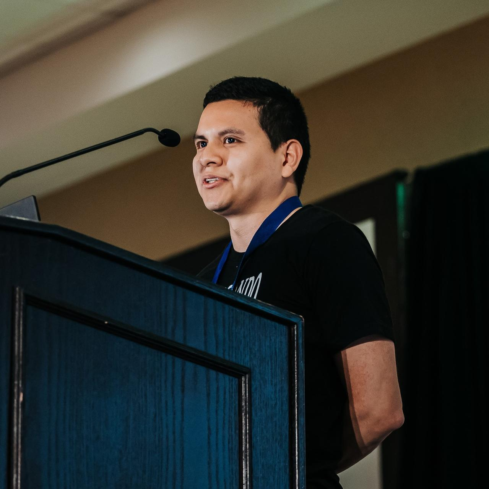

# Santos Gallegos

{ width=150px }

## Laboral experience

- **Read the Docs, Inc**: Software developer (2018 - present)
- **Cooperativa CB**: Computer security audit (2022)
- **Impodirect, CIA LTDA**: Computer security audit (2021 - 2022)
- **Cooperativa CB**: Computer security audit (2020)

## Contests

- **Devsu Code Jam**: 7th place, professionals category (2019)
- **IEEEXtreme Programming 11.0**: 1st place nationally (trivialbox team) (2017)
- **IEEEXtreme Programming 10.0**: 1st place nationally (trivialbox team) (2016)
- **Rally Latinoamericano de Innovación**:
  1st place locally (Cuenca) and nationally in the innovation category (Atuk Maskhay team) (2016)
- **Hackaton UPS**: 2nd place (trivialbox team) (2016)
- **IEEEXtreme Programming 9.0**: 3rd place nationally (EnigmaT team) (2015)

## Programming languages and skills

- Python
- Django
- C
- Git
- Free and Open Source Software
- Elastic Search
- Testing
- Computer security
- Algorithms
- Problem solving
- Web development
- Linux
- Open Source maintainer
- Rust

## Languages

- Spanish (native)
- English (fluent)

## Social

- **GitHub**: <https://github.com/stsewd>
- **Hackerrank**: <https://www.hackerrank.com/stsewd>
- **HackerEarth**: <https://www.hackerearth.com/@stsewd>
- **Stack Overflow**: <http://stackoverflow.com/users/5689214/>
- **LinkedIn**: <https://www.linkedin.com/in/stsewd/>
- **Personal blog**: <https://stsewd.dev>
- **Email**: <stsewd@proton.me>

## Publicly disclosed security vulnerabilities

Over the years I've been responsibly reporting security vulnerabilities, some have been made public.

- [GHSA-hqwg-gjqw-h5wg](https://github.com/readthedocs/readthedocs.org/security/advisories/GHSA-hqwg-gjqw-h5wg) (2023)
- [GHSA-7fcx-wwr3-99jv](https://github.com/readthedocs/readthedocs.org/security/advisories/GHSA-7fcx-wwr3-99jv) (2023)
- [CVE-2022-25860](https://www.cve.org/CVERecord?id=CVE-2022-25860) (2022)
- [GHSA-368m-86q9-m99w](https://github.com/readthedocs/readthedocs.org/security/advisories/GHSA-368m-86q9-m99w) (2022)
- [GHSA-98pf-gfh3-x3mp](https://github.com/readthedocs/readthedocs.org/security/advisories/GHSA-98pf-gfh3-x3mp) (2022)
- [GHSA-3v5m-qmm9-3c6c](https://github.com/readthedocs/readthedocs.org/security/advisories/GHSA-3v5m-qmm9-3c6c) (2021)
- <https://docs.readthedocs.io/en/stable/security.html#release-2-3-0> (2018)

## Open source projects

A list of some of the open source projects I've created,
help to maintain, or made substantial contributions to.

- <https://github.com/gitpython-developers/GitPython>
- <https://github.com/nvim-treesitter/nvim-treesitter>
- <https://github.com/nvim-treesitter/tree-sitter-query>
- <https://github.com/pythonecuador/pythonecuador.github.io>
- <https://github.com/readthedocs/readthedocs.org>
- <https://github.com/rstcheck/rstcheck>
- <https://github.com/stsewd/fzf-checkout.vim/>
- <https://github.com/stsewd/gx-extended.vim/>
- <https://github.com/stsewd/sphinx.nvim/>
- <https://github.com/stsewd/sphinx.nvim/>
- <https://github.com/stsewd/spotify.nvim/>
- <https://github.com/stsewd/tree-sitter-rst/>
- <https://github.com/wntrblm/nox>
